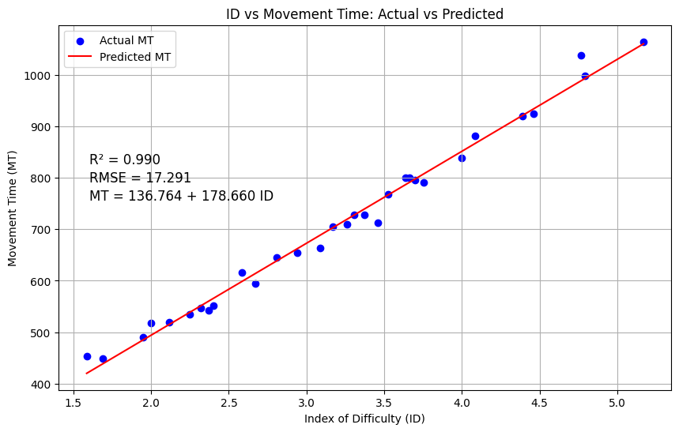
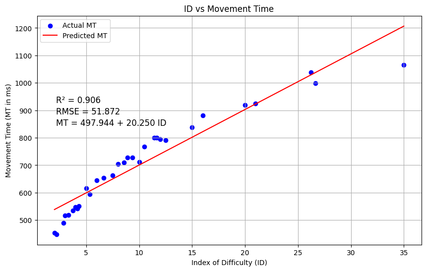

# Human-Performance-Modeling

## Overview
This repository  involves modeling human performance using **Fitts' Law** and the **Steering Law** through linear regression. The goal is to analyze input data, compute the index of difficulty (ID), predict movement time (MT), and evaluate the model's performance.

## Files and Structure
```
📂 Human Performance Modeling
│── notebook.ipynb             # Jupyter Notebook with implementation and explanations
│── results_FL.csv             # Results file for Fitts' Law
│── results_SL.csv             # Results file for Steering Law
│── data/
│   ├── FL.csv                 # Input dataset for Fitts' Law
│   ├── SL.csv                 # Input dataset for Steering Law
│── README.md                  # Project documentation (this file)
```


## 1. Fitts' Law
- Compute **Index of Difficulty (ID)** using the formula:
  $ID = \log_2 \left( \frac{D}{W} + 1 \right)$
- Perform **linear regression** to model:
  $MT = a + b \times ID$
- Plot **ID vs. MT** (both actual values and model predictions).
- Compute **R-Squared** and **RMSE** to evaluate the model.
- Provide observations and conclusions.
- Save results in `results_FL.csv` (containing `a, b, R_Squared, RMSE`).



### Final Observation: Fitts Law

The Linear Regression model gave the values of a=136.76 and 𝑏=178.66. The R² or the coefficient of determination is 0.99 which indicates that the model explains approximately 99% of the variance in the data and the RMSE is 17.29 and that is a reasonably small error relative to the scale of the dependent variable. Hence we can say that Linear Regression model is effective in modeling Fitts Law.


### 2. Steering Law
- Compute **Index of Difficulty (ID)**.
- Perform **linear regression** to model:
  $MT = a + b \times ID$
- Plot **ID vs. MT** (both actual values and model predictions).
- Compute **R-Squared** and **RMSE** to evaluate the model.
- Provide observations and conclusions.
- Save results in `results_SL.csv` (containing `a, b, R_Squared, RMSE`).

### Final Observation: Steering Law

The Linear Regression model gave the values of a=497.94 and 𝑏=20.25. The R² or the coefficient of determination is 0.90 which indicates that the model explains approximately 90% of the variance in the data and the RMSE is 51.87 and that is a moderate error relative to the scale of the dependent variable. Though the model captures a significant portion of the variance there can be improvement in R² and RMSE values

